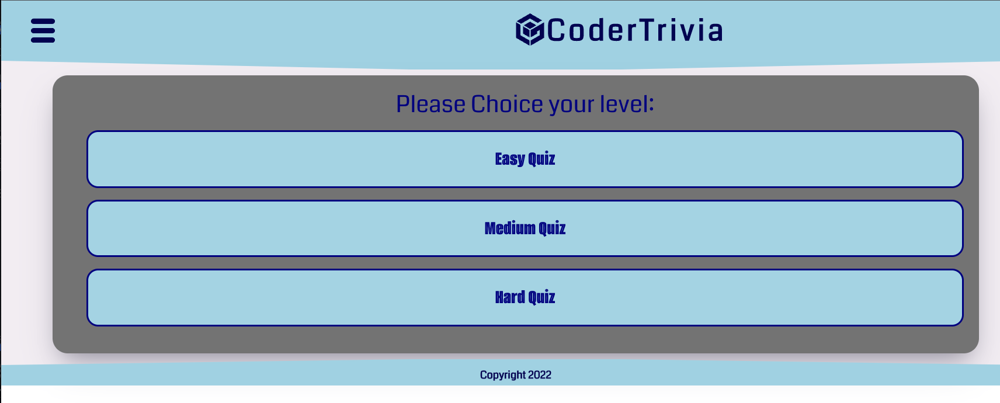
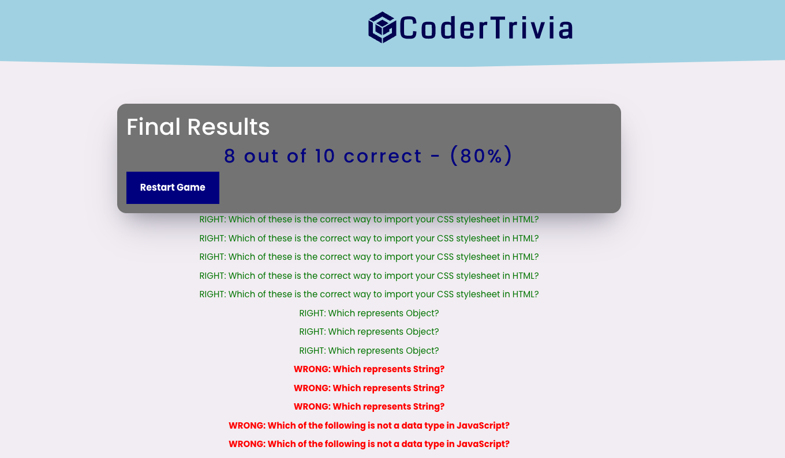
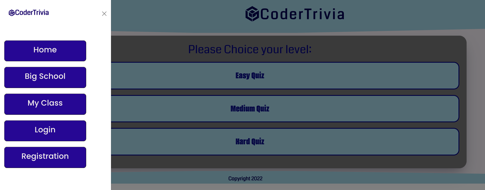

  <h3 align="center">CoderTrivia Project</h3>

  

   This quiz application is designed for web developers to test their knowledge!
     
    

     
     
    ·
    

     <h4>CoderTrivia</h4>
      
      
      
    

   
    ·

  

## About the Project
  
###### Welcome to our interactive quiz platform for web developers! With this application, you can test your knowledge and skills in web development, and even create your own quizzes to share with your students or peers. Whether you are looking for a challenge or just want to brush up on your fundamentals, we have three difficulty levels to choose from: easy, medium, and hard. At the end of each quiz, you will receive a score report showing the percentage of questions that you answered correctly. Whether you are a beginner or an experienced developer, we hope this platform will help you grow and succeed in your field.

## Built With
* React
* Redux
* Sequelize
* Express
* Axios
* Bootstrap
* Bcrypt
* JavaScript
* Bootstrap
* PostgreSQL
* CSS
* Rest APIs

<!-- CONTACT -->
## Contact and Contributors

Daniel Moros - [Daniel's Portfolio](https://ddmoros.wixsite.com/ddmportfolio) - [Daniel's GitHub](https://github.com/Ddmoros) - ddmoros@gmail.com

Dmitry Shunin - [Dmitry's Portfolio](https://dmitry-shunin.netlify.app/index.html) - [Dmitry's GitHub](https://github.com/Dimasik0204) - dmitryshunin0204@gmail.com

Elyas Ozbek - [Elyas's Portfolio](https://elyasozbek.dev) - [Elyas's GitHub](https://github.com/ElyasO03) - elyas.ozbek07@gmail.com

