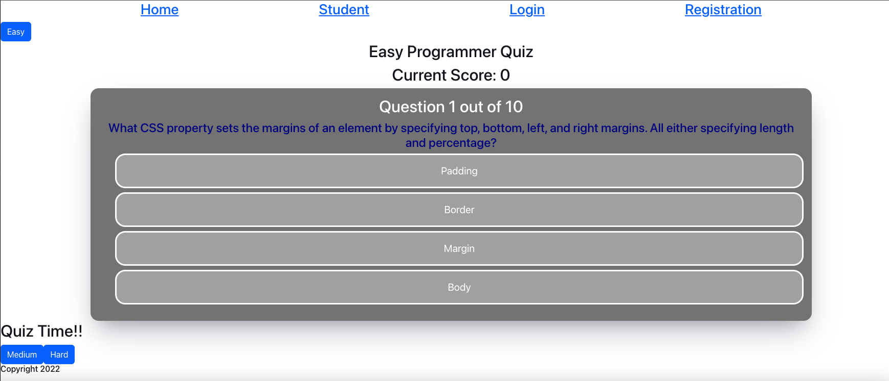

  <h3 align="center">CapStone Project</h3>

  

   This quiz application is deigned for web developers to test their knowledge!
     
    

     
     
    ·
    

      <a href="#">View Demo</a>
      
    

   
      <h4 ">About The Project</h4>
      
This application was designed to allow web developers to test their knowledge, and teachers to create new quizzes for their students. There are three difficulty levels to choose from: easy, medium, and hard. At the end of the quiz, the user will be able to see the percentage of questions that were answered correctly 

      <ul>
        <li><h4>Built With</h4></li>
        
react, redux, sequelize, express, axios, bootstrap, and bcrypt

      </ul>
    ·

  

<!-- CONTACT -->
## Contact and Contributors

Daniel Moros - [Daniel's Portfolio](https://ddmoros.wixsite.com/ddmportfolio) - [Daniel's GitHub](https://github.com/Ddmoros) - ddmoros@gmail.com

Dmitry Shunin - [Dmitry's Portfolio](https://twitter.com/your_username) - [Dmitry's GitHub](https://github.com/Dimasik0204) - email@example.com

Elyas Ozbek - [Elyas's Portfolio](https://twitter.com/your_username) - [Elyas's GitHub](https://github.com/ElyasO03) - email@example.com

